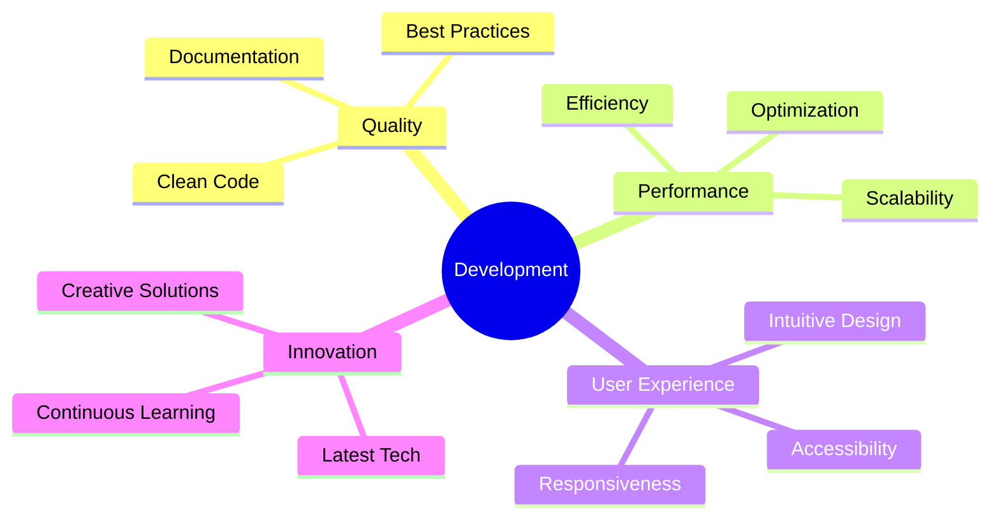

  

###

<h4 align="center">My name is Faisal Hossain and I'm a Web Developer from Bangladesh</h4>

###

<h2 align="left">About me</h2>

###

###

👋 Hi, I’m Faisal Hossain  Front-End Web Developer | 🇧🇩 Bangladesh  🎓 Background: Computer Science & Engineering 💡 Motto: Build with purpose. Design with clarity. Code with care.  🚀 What I do: I craft modern, responsive, and user-friendly web experiences with a strong focus on performance, scalability, and clean architecture.  🎯 Current Focus: Creating fast, accessible, and visually engaging web applications using modern front-end technologies.  😄 Fun Fact: I enjoy breaking things just to understand how to fix them better 😄

###

<h2 align="left"></h2>

###

“When everything feels lost, I remember this—I still have Allah, and that is enough. 🤍” ————The world can take everything from me, but it can never take Allah from my heart. 🕊️

###

<h2 align="left">I code with</h2>

###

<h3 align="center">Frontend Technologies</h3>

###

  
  
  
  
  
  
  
  
  
  
  
  
  
  
  

###

<h3 align="center">⚙Backend & Database</h3>

###

  
  
  
  
  

###

<h3 align="center">Tools & Platforms</h3>

###

  
  
  
  
  
  
  

###

<h3 align="center">Extra Knowledge</h3>

###

  
  
  
  
  
  
  

###

<h2 align="left">📈 Development Activity</h2>

###

React   12 hrs 30 mins  ████████████░░░░░░░░░  60.5% JavaScript   4 hrs 15 mins   ████░░░░░░░░░░░░░░░░░  20.8% TypeScript        2 hrs 45 mins   ██░░░░░░░░░░░░░░░░░░░  13.4% CSS          1 hr 10 mins    ░░░░░░░░░░░░░░░░░░░░░   5.3%

---

## My Development Philosophy

---

###

<h2 align="left">Education & Featured Projects</h2>

###

🎓 Education Bachelor of Science in Computer Science and Engineering BGIFT Institute of Science & Technology ________________________________________ 🛠 Core Competencies •	Full-Stack Development – From frontend to backend, building complete web solutions •	UI/UX Design Implementation – Crafting intuitive and user-friendly interfaces •	Database Architecture – Efficient, scalable, and secure data management •	Performance Optimization – Fast, responsive, and smooth applications •	Security Best Practices – Secure coding and data protection ________________________________________ 🌟 Featured Projects 🍽 Toll-Bar Management System •	Full-stack web application with user authentication •	On-off management and real-time reporting system •	Live updates & notifications for smooth operations 🏫 School Management System •	Comprehensive academic management platform •	Student, teacher, and attendance tracking •	Examination and grading management system 💻 Portfolio Website •	Modern, responsive, and visually appealing design •	Interactive animations to enhance user experience •	Performance optimized for fast loading and smooth navigation

###

<h2 align="left"></h2>

###

<h3 align="center">Social Media ______________________</h3>

###

  
  
  
  
  
  

###

<h2 align="left"></h2>

###

###

<h2 align="left"></h2>

###

  

###

<h2 align="left"></h2>

###

<picture>
  <source media="(prefers-color-scheme: dark)" srcset="https://raw.githubusercontent.com/faisalhossain0/faisalhossain0/output/pacman-contribution-graph-dark.svg">
  <source media="(prefers-color-scheme: light)" srcset="https://raw.githubusercontent.com/faisalhossain0/faisalhossain0/output/pacman-contribution-graph.svg">
  
</picture>

###

<h2 align="left"></h2>

###

  

###
